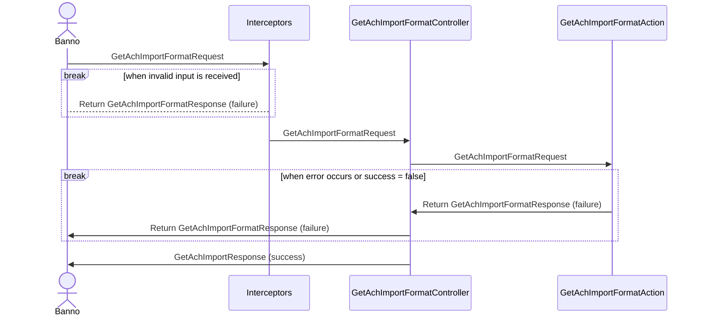

- 👋 Hi, I’m @jha-jeward
- 👀 I’m interested in ...
- 🌱 I’m currently learning ...
- 💞️ I’m looking to collaborate on ...
- 📫 How to reach me ...

Personal repository for experimental projects.

<!---
jha-jeward/jha-jeward is a ✨ special ✨ repository because its `README.md` (this file) appears on your GitHub profile.
You can click the Preview link to take a look at your changes.
--->

```C#
  public enum AchImportFormatType
    {
        None = 0,
        
        [Description("CSV")]
        Csv,
        
        [Description("Fixed")]
        Fixed,
        
        [Description("Tab")]
        TabDelimited,
        
        [Description("Space")]
        SpaceDelimited,
        
        [Description("Binary")]
        Binary,
        
        [Description("NACHA")]
        NACHA
    }
```

##### Sequence Diagram for the controller GET operation


