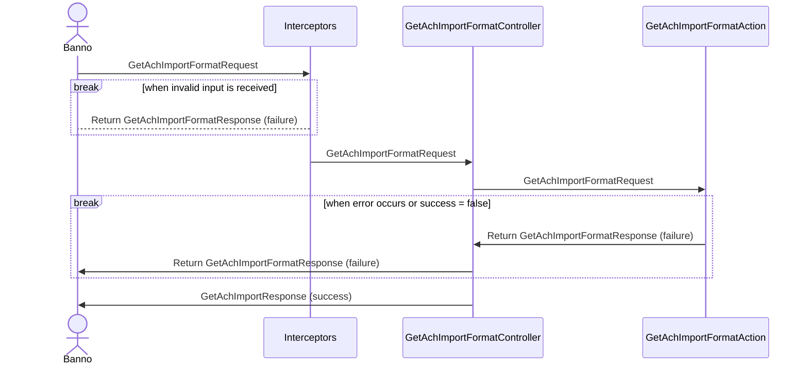

# JHA Technical documents in markdown?

## Update: This crusade was a success

Markdown is now the departmental standard.  Leaving this post for posterity.

See [Authoring Technical Designs in Markdown](https://github.com/Banno/digital-is-jha-wiki/blob/main/Standards-%26-Templates/Tech-Design-using-Markdown.md)

I am suggesting the "way we've always done it" on technical designs is **not the best way** for Jack Henry.  I'm suggesting there is an alternative that offers many upsides with almost zero downsides.  I'm going to make my case here.

### Things that are wrong with the current methodology

| Name                                         | Description
|----------------------------------------------|------------------------------------------
| Organization of intellectual property        | For many reasons, it is preferred that the intellectual property that contributed to the development of the system stay with the system rather than risk being orphaned or misapplied to the wrong system.  How many places do we want to spread this to?  Let's decrease the count.
| Point-in-time synchronization                | Because the current documents are not united with the code repositories, it is hard to answer the question, "what were the requirements when this was implemented?  How did they change later?"  Uniting them in the same source control system makes this much easier.
| Auditing of requirements                     | For compliance reasons, we should be able to audit changes in requirements with the same precision we can audit source code changes.  
| Changes more discernable                     | Net changes made to Word files are difficult to understand with a nasty mess of XML.  Markdown changes are plain-text.
| Freaky properties in word documents          | Okay, you changed all the visible text, but somehow the previous author of the document you copied is still in there.  Where is it?  How do you change it?
| Style nightmares                             | All your're trying to do is add another line to a table, but for some reason, Word styles your new rows totally different than the previous ones.  WHY???  We don't know.  We just hates it Gollum, we hates it.
| Assembly from multiple sources               | You shouldn't have to wonder, "did I grab a screenshot from that diagram I saved over yonder?  Are we in sync?"

### Reasons why my recommendation is not radical

- I am recommending we use the **native default documenting language used on Github**.
- The whole world already uses it.  Literally thousands of sites all across Github and other providers use this technique.
- The approach is **well documented**.
- Mermaid documents are supported **inline**, not copy/pasted from some other crazy source.
- Code snippets are supported with automatic syntax hightlighting for a variety of languages incliding C#, SQL, JSON.
- Technical requirements can live in the same place where our source code lives.  Imagine that!
- Easy to include screen shots and **all** artifacts used.
- Easy to reference source code artifacts with links.
- Easy to create a PDF from the content with all graphics rendered.
- I can have my entire technical document in ONE FILE instead of having to search all over Sharepoint for the supporting sequence diagram source code.
- Mermaid support is **current**.
- You can browse to your documentation in the gibhub repo and the content renders without any special tools.

### Samples of tech content rendered inline

##### How about a peek at some source code?

Notice the syntax highlighting that we see in the code snippet below.

```C#
/// <summary>
///     Initializes the tests.
/// </summary>
[TestInitialize]
public void TestInitialize()
{
    this.mockAccess ??= new CreateAchTemplateAccess(contextProvider,
        this.ContextOptions);
}
```

##### Example sequence diagram



##### Company logo?

How about the one from the JHA site with that fancy new blue dot?


