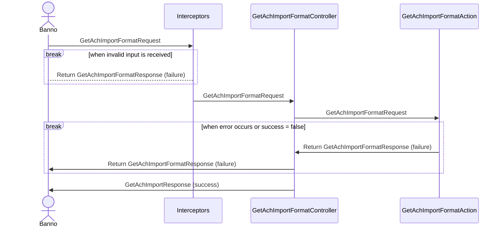

# JHA Technical documents in markdown?

```C#
  public enum AchImportFormatType
    {
        None = 0,
        
        [Description("CSV")]
        Csv,
        
        [Description("Fixed")]
        Fixed,
        
        [Description("Tab")]
        TabDelimited,
        
        [Description("Space")]
        SpaceDelimited,
        
        [Description("Binary")]
        Binary,
        
        [Description("NACHA")]
        NACHA
    }
```

##### Sequence Diagram for the controller GET operation


