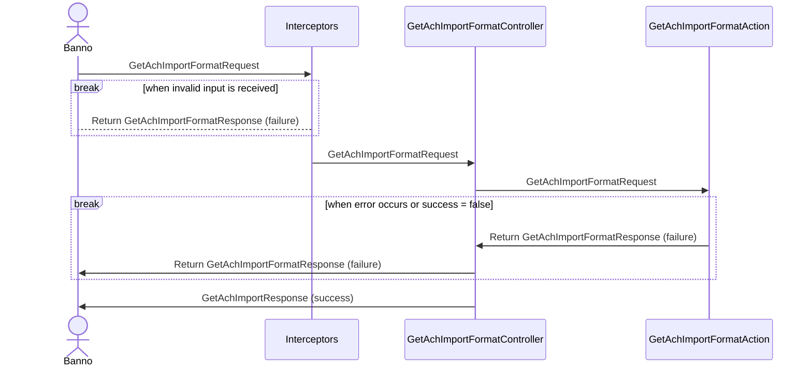

# JHA Technical documents in markdown?

I am suggesting the "way we've always done it" on technical designs is **not the best way** for Jack Henry.  I'm suggesting there is an alternative that offers many upsides with almost zero downsides.  I'm going to make my case here.

### Things that are wrong with the current methodology

| Name            | Description
|---------------|------------------------------|
| Sharepoint mermaid support is downlevel | You've spent all this time creating a class diagram in the online editor only to find when you save it, Sharepoint can't render it.  The only way you can copy/paste your image is from the mermaid live editor online.
| One diagram only?? | You look at the previous projects before you.  They have precisely one diagram per project, but to adequately document your intended work, you need at least 8-10.  What do you do?  Create numbered different diagrams?  Then reference them in the bottom of the Word document?
| Sharepoint path changes | Okay, now for eons you've been creating this table at the bottom of your Word document to cross-reference your sequence diagrams, and bango-whammo, the Sharepoint admin makes some URL changes and blows up all those links.
| Change control supported? | Supposedly, Sharepoint is supporting change control on your Word document and you could roll-back to a previous version, but I don't know how to do this?  Do you?  Is it worth the pain?  Would the net change be recognizable?  Or full of funky weird XML stuff?
| No unison with source code | There is no linkage whatsoever between source code in the repository and the documentation that drives changes to that repository.  How could an auditor or anyone else ever unit the two?  Nightmare.
| Freaky properties in word documents | Okay, you changed all the visible text, but somehow the previous author of the document you copied is still in there.  Where is it?  How do you change it?
| Style nightmares | All your're trying to do is add another line to a table, but for some reason, Word styles your new rows totally different than the previous ones.  WHY???  We don't know.  We just hates it Gollum, we hates it.

### Reasons why my recommendation is not radical

- I am recommending we use the **native default documenting language used on Github**.
- Literally thousands of sites use the same methodology.
- The approach is **well documented**.
- Mermaid documents are supported **inline**, not copy/pasted from some other crazy source.
- Code snippets are supported with automatic syntax hightlighting for a variety of languages incliding C#, SQL, JSON.
- Technical requirements can live in the same place where our source code lives.  Imagine that!
- Easy to include screen shots and **all** artifacts used.
- Easy to reference source code artifacts with links.
- Easy to create a PDF from the content with all graphics rendered.
- I can have my entire technical document in ONE FILE instead of having to search all over Sharepoint for the supporting sequence diagram source code.
- Mermaid support is **current**.

### Samples of tech content rendered inline

##### How about a peek at some source code?

```C#
        /// <summary>
        ///     Initializes the tests.
        /// </summary>
        [TestInitialize]
        public void TestInitialize()
        {
            this.mockAccess ??= new CreateAchTemplateAccess(contextProvider,
                this.ContextOptions);
        }
```

##### Example sequence diagram


